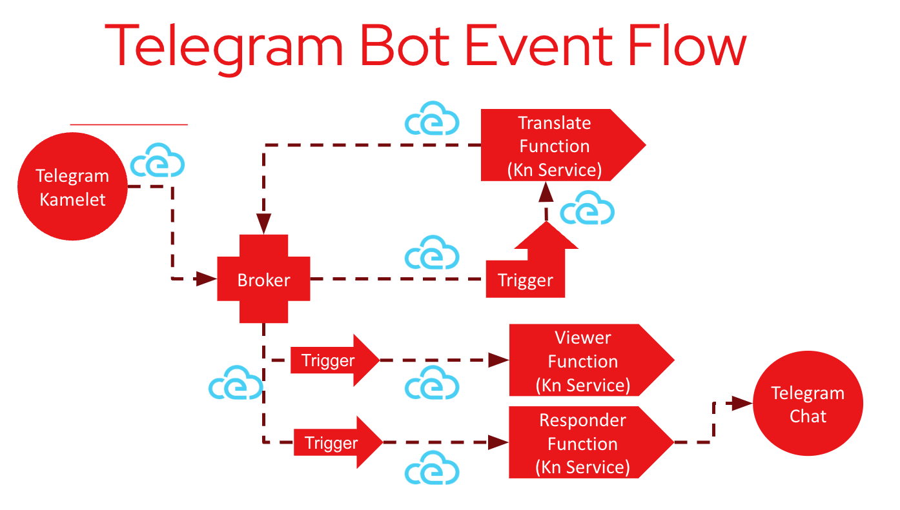

# Knative and Camel-K Telegram Translate Bot Example

This demo converts Telegram messages into English using Camel-K and Knative functions.

It uses a Camel-K Kamelet to periodically poll Telegram for messages.
The Kamelet converts each message into a CloudEvent, sending it to the default Knative
Broker. A `translate` function receives these events via a `Trigger` between the
`Broker` and the function which filters for these types of events.

The `translate` function uses the Google Translation API is used to convert the
message text to English, and the result is returned to the broker as `data` in a new
translation CloudEvent.

The broker has two additional triggers that respond to these translation events. One
forwards the event to a `viewer` function, which simply displays the event on the
console so that we can see if things are behaving as expected. The other trigger sends
the event to a `responder` function, which responds to the message in the Telegram
chat with the translation.



## Prerequisites
* A cluster with Knative installed
* CamelK https://camel.apache.org/camel-k/1.9.x/installation/installation.html installed
* Google Translation API key in `translate/service-account-file.json`
* Update the Twitter API credentials in [./resources/twitter-search-source-binding.yaml](resources/twitter-search-source-binding.yaml)

## Steps
* Ensure your Google Translation API key is correctly set in `translate/service-account-file.json`
* Create a Kubernetes secret containing your Telegram API key
```
kubectl create secret generic telegram --from-literal=API_KEY=<apikey>
```
* Configure the `translate`, `responder` and `viewer` functions with application labels
```
func config labels add -p translate
# Add a label with the key "app" and the value "translate"

func config labels add -p viewer
# Add a label with the key "app" and the value "viewer"
```

* Deploy the `translate` and `viewer` functions
```
func deploy -p viewer
func deploy -p translate
```

* Install a default Knative Broker
```
kn broker create default
```

* Create the Telegram->Translate trigger
```
kn trigger create telegram-trigger -s translate --filter type=telegram.source
```

* Create the Translation->Viewer trigger
```
kn trigger create translate-trigger -s viewer --filter type=knative.function.translation
```

* Create the Translation->Responder trigger
```
kn trigger create responder-trigger -s responder --filter type=knative.function.translation
```

* Install the Kamelet
```
kubectl apply -f resources/telegram-binding-v1.yaml
```

* Check the logs
```
k logs -l app=viewer -f
k logs -l app=responder -f
k logs -l app=translate -f
```

* Cleanup
```
./resources/teardown.sh
```
